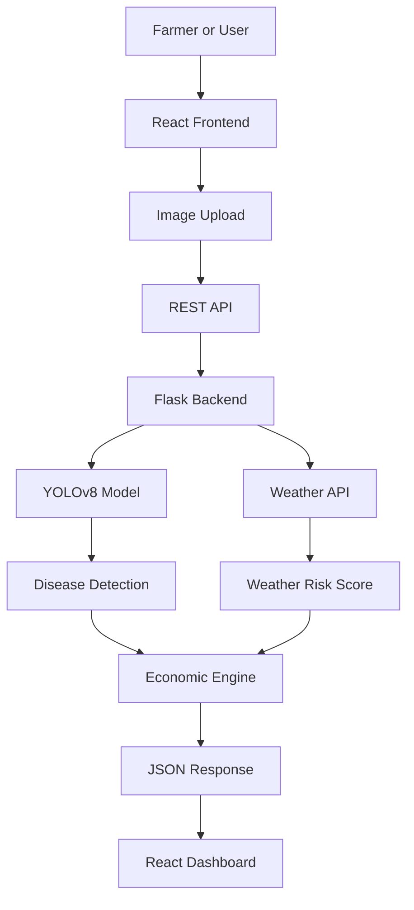
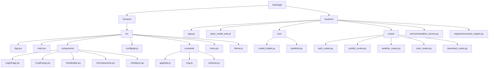

# 🌾 KrishiVigil.ai — Smart Crop Protection
---

<p align="center">
  
  
  
  
  
  
  
</p>

<p align="center">
  <b>AI-powered crop disease detection & farm advisory system for Indian farmers</b><br>
  Upload a crop image → Get diagnosis, treatment & economic insights in seconds 🚀
</p>

---

## 📄 License

© Belongs to @KrishnaVatsa & @Anand1-here  
Research & Analysis: Kaustuv Baidya & Divyansh Kumar

---

## ⚠️ Note:

- `plant_model_yolo.pt` is **not included** in this repository (too large for GitHub)

---

## 📌 What It Does

KrishiVigil.ai lets farmers upload an image of any infected part of their crop — leaf, fruit, stem, or plant surface — and instantly receive:

- 🤖 **AI disease detection** with confidence score (52 disease classes across 14 crop types)
- 📊 **Crop health score** (1–10) based on AI confidence + weather + yield loss
- ⏱ **Treatment urgency timeline** — act within X hours
- 🧪 **Fungicide recommendations** — Indian brand names, doses, and timing
- 🌦 **Live weather risk analysis** — disease spread risk from real GPS-based weather
- 💰 **Economic loss in ₹** — calculated using government MSP rates and ICAR yield data
- 🏛 **Government scheme matching**
- 📄 **Downloadable crop health report**
- 🕒 **Scan history**
- 🌐 **Multilingual UI**

---

## 🛠 Tech Stack

| Layer | Technology | Version |
|---|---|---|
| Frontend | React | ^19.2.0 |
| Frontend Build | Vite | ^7.3.1 |
| Backend | Flask (Python) | 3.0.2 |
| Cross-Origin | Flask-CORS | 4.0.0 |
| AI Model | YOLOv8x-cls | ultralytics>=8.2.0 |
| Image Processing | Pillow | 10.2.0 |
| Math | NumPy | 1.26.4 |
| Weather API | OpenWeatherMap | Free tier |
| HTTP Client | Requests | 2.31.0 |
| Storage | JSON-based | — |

---

## 🏗 System Architecture



---

## 🤖 AI Model

| Property | Details |
|---|---|
| Architecture | YOLOv8x-cls (Ultralytics) |
| Framework | PyTorch |
| Dataset | PlantVillage (87k+ images) + custom Rice & Wheat |
| Classes | 52 |
| Accuracy | 96–98% |
| Model file | `plant_model_yolo.pt` |

---

## Project Structure (Visual)



---

## 🔄 How It Works — Full Request Flow

1. Farmer opens app  
2. Uploads crop image  
3. Backend fetches weather  
4. AI model predicts disease  
5. Economic loss calculated  
6. JSON response returned  
7. Dashboard shows insights  

---

## 🧮 Key Calculations

**Health Score (1–10)**
```
score = 10 - [(confidence/100 × 3.5) + (loss_pct × 4.0) + (weather_risk/100 × 2.5)]
```

**Economic Loss (₹)**
```
effective_loss = (confidence/100) × yield_loss_pct × (1 + weather_risk/100)
```

---

## 🖥 Running Locally

### Backend
```bash
cd backend
pip install -r requirements.txt
python app.py
```

### Frontend
```bash
cd frontend
npm install
npm run dev
```

---

## 🔌 API Endpoints

- `POST /predict` → Disease detection  
- `GET /weather` → Weather data  
- `POST /auth/login` → Login  
- `POST /auth/register` → Register  

---

## 💾 Persistent Storage

- JSON-based storage  
- No database required  
- Data persists across restarts  

---

## 🌍 Impact

- ⏱ Diagnosis time: **3–7 days → 3 seconds**  
- 💸 Reduces crop loss  
- 🌱 Improves farmer decisions  

---

## ⭐ Support

If you like this project, give it a ⭐ on GitHub!

---

<p align="center">
  Built with ❤️ for Farmers
</p>
