## KrishiVigil.ai-
"SMART CROP PROTECTION"

## Description:-                                                                                                      
KrishiVigil.ai is an AI-powered agriculture platform that helps farmers detect crop diseases early using computer vision. 
Farmers can upload images of any infected part of a crop (leaf, fruit, stem, or plant surface). The system analyzes the image using a deep learning model
and generates a complete crop health report including disease prediction, confidence score, yield loss estimation, treatment suggestions, weather risk analysis, 
and government scheme recommendations.

## Features:-
- 🌿 AI-based crop disease detection from leaf, fruit, stem, or any infected plant area
- 📊 Crop health score and disease severity analysis
- ⏱ Treatment urgency timeline
- 🧪 Smart treatment and fungicide recommendations
- 🌦 Weather risk intelligence for disease spread
- 💰 Crop loss and financial impact estimation
- 🏛 Government scheme recommendations for farmers
- 📄 Downloadable crop health report
  
## AI Model:-
- Dataset: PlantVillage Dataset (Kaggle)
- Framework: TensorFlow / Keras
- Architecture: EfficientNetB3 (Transfer Learning)
- Training Platform: Kaggle Notebook
- Validation Accuracy: ~99%
The trained model is exported as a `.h5` file and integrated with the Flask backend for real-time disease prediction.

 ## Tech Stack:-
 - Frontend: React + Vite, runs at http://localhost:5173
- Backend: Flask (Python 3.11), runs at http://localhost:5000
- AI Model: EfficientNetB3 trained on PlantVillage dataset (Kaggle)
  99.6% accuracy, 38 classes, exported as plant_model.h5
- Weather: OpenWeatherMap free API (key: c8d59e65197776ffdefe8cdcf61e726e)

## FOLDER STRUCTURE:-
C:\Users\wtcaa\krishivigil\
├── frontend\
│   └── src\
│       └── App.jsx         (single file React app — all UI here)
└── backend\
    ├── app.py              (Flask entry point)
    ├── plant_model.h5      (Kaggle EfficientNetB3 model)
    ├── requirements.txt
    ├── core\
    │   ├── model_loader.py (loads .h5, auto-detects class count)
    │   └── predictor.py    (inference, health score, urgency, advice)
    ├── routes\
    │   ├── predict_routes.py  (POST /predict endpoint)
    │   └── weather_routes.py  (GET /weather endpoint)
    ├── services\
    │   └── weather_service.py (OpenWeatherMap API integration)
    └── engines\
        └── economic_engine.py (Rs loss calculator)
        
## HOW IT WORKS (full flow):-
1. Farmer opens app → browser GPS detects location
2. App calls GET /weather?lat=X&lon=Y → live weather loads
3. Farmer uploads crop leaf image + fills crop name + land size popup
4. App calls POST /predict with FormData: image, crop, land, lat, lon
5. Flask runs: weather API → EfficientNetB3 inference → economic calc
6. Returns JSON with all result dashboard values
7. React renders: health score, urgency timeline, disease detection,
   action checklist, fungicide recommendations, weather risk,
   economic loss, government schemes

## KEY CALCULATIONS:-
- Health Score (1-10) = 10 - [(confidence/100×3.5) + (loss_pct×4.0) + (weather_risk/100×2.5)]
- Urgency Hours = starts at 72h for low confidence, shrinks to 6h at 90%+ confidence
- Economic Loss = (confidence/100) × yield_loss_pct × (1 + weather_risk/100) × total_crop_value
- Weather risk score = calculated from real temp + humidity + rain + wind values

## RESULT DASHBOARD — ALL DYNAMIC:-
- Crop health score → from AI confidence + weather + yield loss
- Urgency timeline → from AI confidence %
- Disease name + confidence bars → from AI model output
- Action checklist → per disease + per crop from ADVICE_DB
- Fungicide recommendations → per disease + per crop
- Weather strip + warnings → from live OpenWeatherMap API
- Economic loss in Rs → from AI + weather + MSP database
- Government schemes → matched to detected disease + loss amount

## DEMO MODE:-
When plant_model.h5 is missing OR Flask is offline,
frontend shows hardcoded demo: Late Blight, 87.4%, 3/10, 18 hours
Once Flask runs with model, all values become real AI output

## PLANTVILLAGE 38 CLASSES:-
Standard alphabetical order used by Kaggle ImageDataGenerator
Mapped to 4 display categories: Late Blight, Early Blight, Leaf Spot, Healthy

## MSP DATABASE:-
35+ Indian crops with government MSP rates and yield per acre
Used for economic loss calculation

## ADVICE DATABASE (ADVICE_DB in predictor.py):-
Per-disease + per-crop action checklists and fungicide recommendations
Crops covered: tomato, potato, corn/maize, grape + default fallback
Diseases: Late Blight, Early Blight, Leaf Spot, Healthy
Indian fungicide brand names used (Ridomil Gold, Dithane M-45, etc.)

## FRONTEND KEY DETAILS:-
- API_BASE = "http://localhost:5000" (top of App.jsx)
- GPS: navigator.geolocation on login → calls fetchWeather()
- Image upload → handleAnalyze() → POST /predict → setApiResult(data)
- All result cards read from apiResult (Flask JSON response)
- weatherData state populated from GET /weather or from /predict response

## Application Screenshots

Home Screen
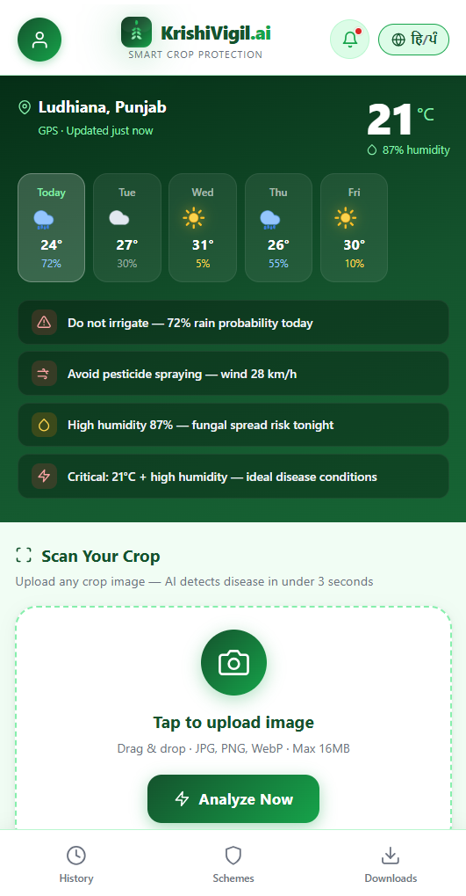
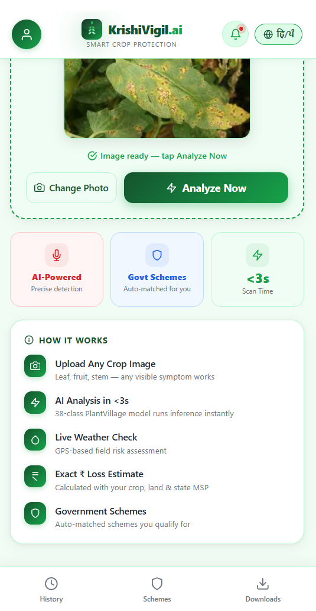

Profile
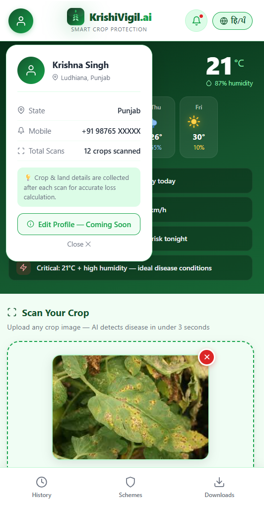

Language change
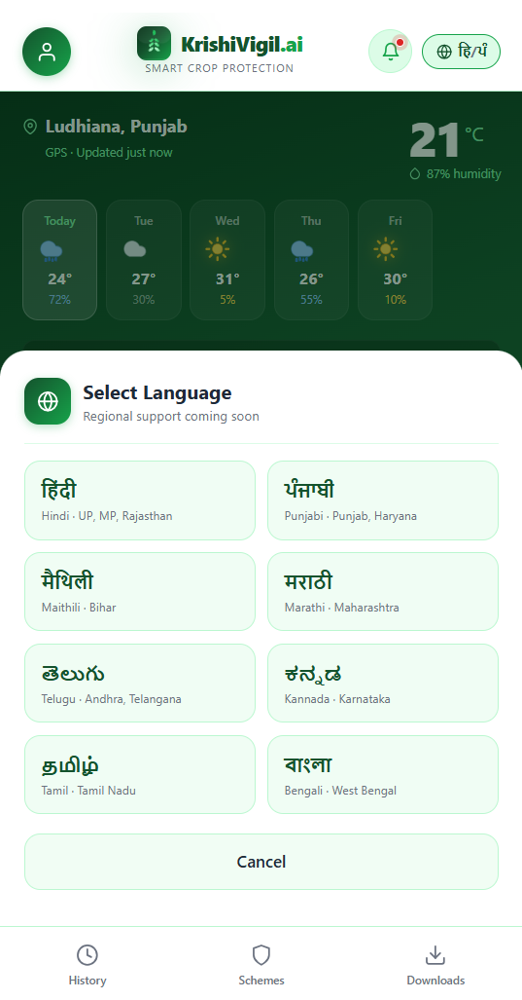

Image Upload
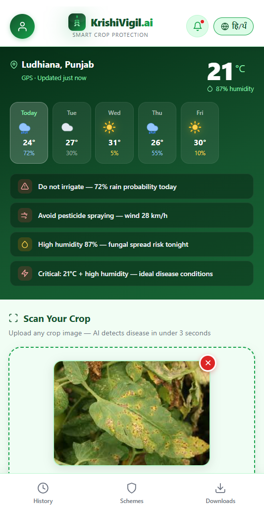

Farm Details I/P from user
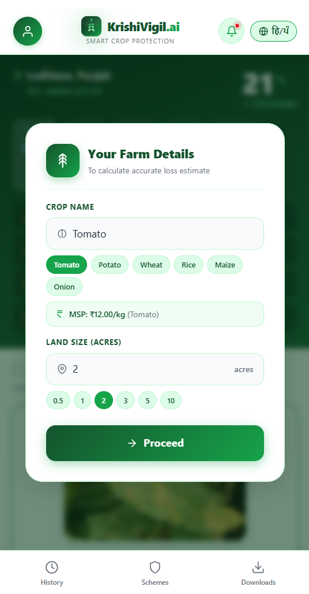

Result Dashboard
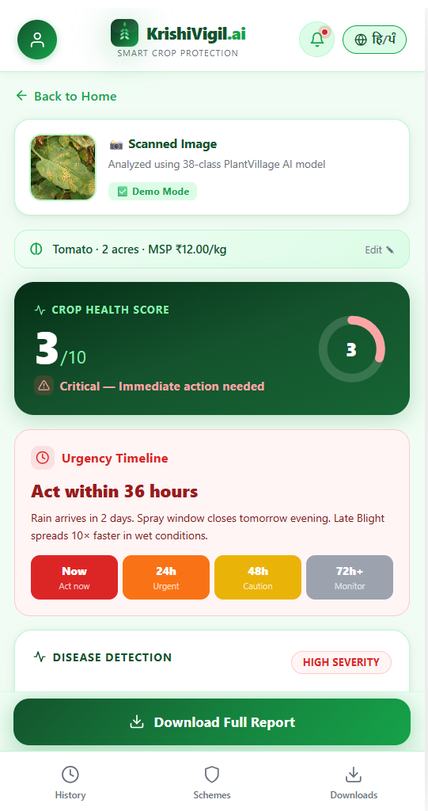

Disease Detection Result
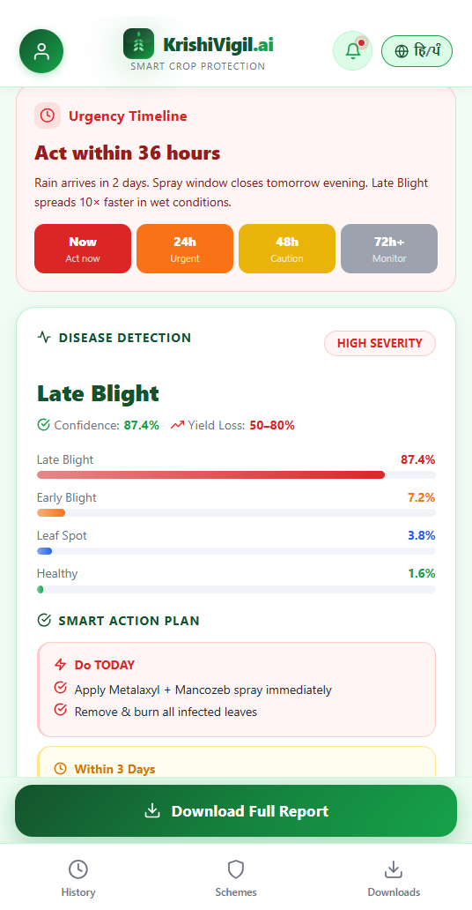

Treatment Recommendations & Action Plan 
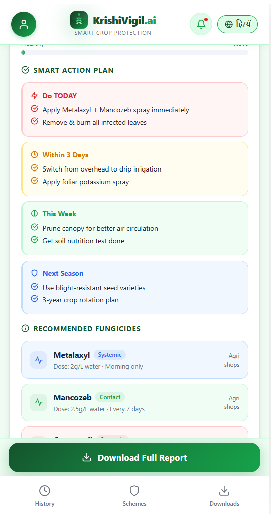

Weather Risk Analysis
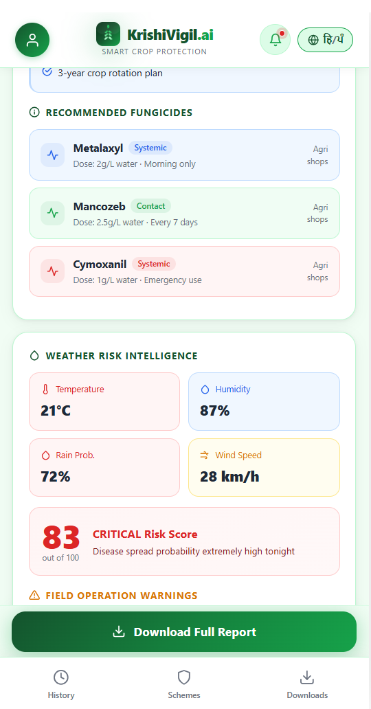
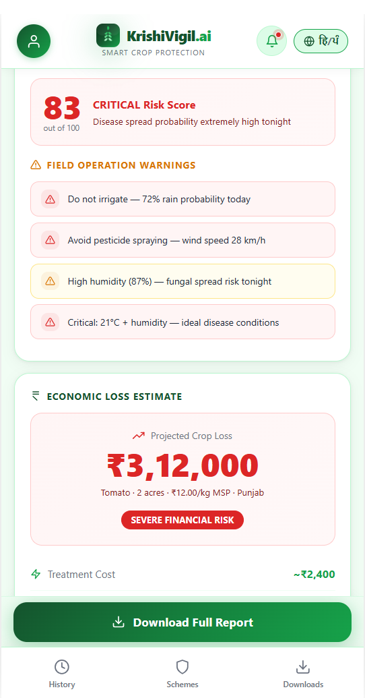

Financial Loss Estimation & Government Scheme Suggestions
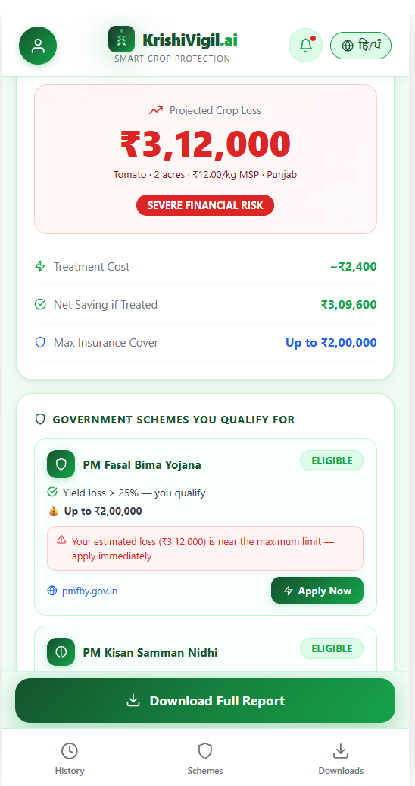

Explopre Govt schemes
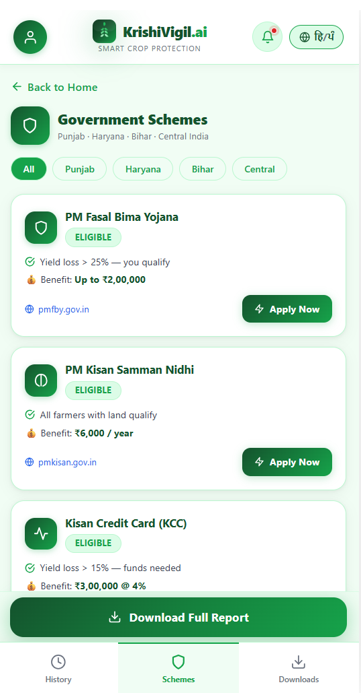

Download Prv search Crop Health Report
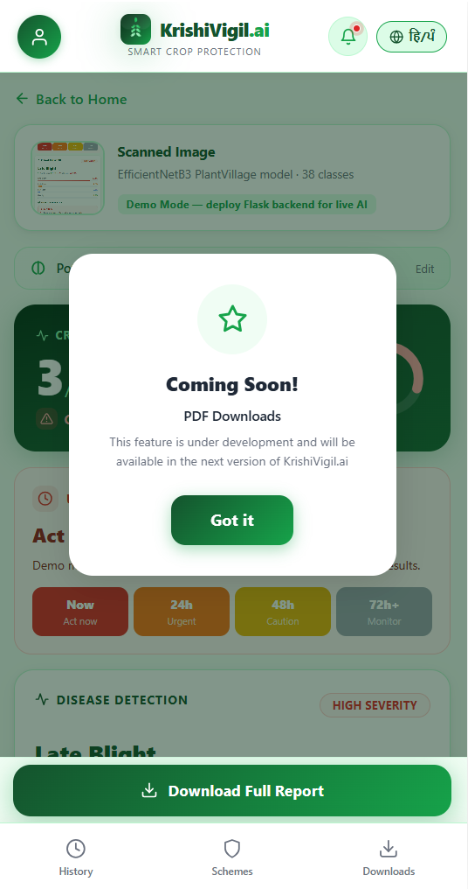
